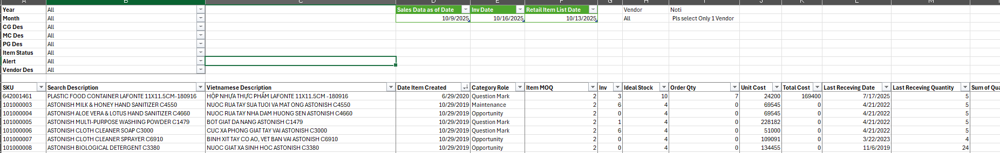

# 📊 Local Replenishment System – Data-Driven Purchasing Optimization

> _“Từ cảm tính sang dữ liệu – từ phản ứng sang chủ động.”_  
> Đây là một trong những dự án mà tôi tâm đắc nhất, vì nó không chỉ giải quyết vấn đề kỹ thuật mà còn thay đổi cả **tư duy vận hành của phòng Merchandise** trong việc ra quyết định mua hàng.

---

## 📘 Giới thiệu
Trước đây, việc mua hàng nội địa được thực hiện dựa vào **kinh nghiệm cá nhân của Buyer**, thường theo nguyên tắc đơn giản:  
> “Bán được 10 thì mua lại 10.”  

Cách làm này tuy hiệu quả với ít cửa hàng, nhưng khi hệ thống mở rộng, nó bộc lộ hai vấn đề lớn:

1. **Thiếu hàng cho SKU bán chạy**, khiến cơ hội bán bị bỏ lỡ.  
2. **Tồn kho cao cho SKU bán chậm**, gây ra vốn bị “kẹt” trong tồn kho.  

Thêm vào đó, việc ra quyết định mua hàng hoàn toàn **không có dữ liệu chứng minh**. Quản lý phòng Merchandise không thể kiểm chứng được **Purchase Order** được tạo ra dựa trên cơ sở nào, và liệu quyết định đó có thực sự hợp lý hay không.

---

## 🎯 Mục tiêu dự án
- Xây dựng một **bộ công cụ Local Replenishment** giúp tất cả Buyer ra quyết định dựa trên **dữ liệu thống nhất và được cập nhật hằng ngày**.  
- Cung cấp **toàn bộ thông tin quan trọng** để Buyer ra quyết định mua hàng:
  - Lịch sử bán hàng có thể lọc theo thời gian  
  - Thông tin vendor, ngành hàng, cửa hàng  
  - Giá cost, tồn kho hiện tại, tồn kho lý tưởng (Ideal Stock)  
  - Các chỉ số bổ trợ: frequency, suggest order qty...

---

## 🧩 Giải pháp thực hiện
1. **Xây dựng hệ thống lưu trữ dữ liệu chuẩn**  
   - Thiết lập cấu trúc folder và file đồng nhất để đảm bảo dữ liệu có thể được cập nhật tự động.  
   - Chuẩn hóa quy trình đặt tên, liên kết và cập nhật dữ liệu.

2. **Tổng hợp & xử lý dữ liệu bằng Power Query**  
   - Kết nối và làm sạch dữ liệu từ nhiều nguồn: Sales, Inventory, Vendor Info, Ideal Stock, Cost Price.  
   - Chuẩn hóa định dạng và xử lý các vấn đề về thiếu dữ liệu hoặc sai lệch thông tin.  

3. **Xây dựng Data Model bằng Power Pivot**  
   - Tạo mối quan hệ giữa các bảng để phản ánh đúng logic kinh doanh.  
   - Tính toán các chỉ số như Frequency, Suggested Order Quantity... bằng DAX.  

4. **Thiết kế giao diện báo cáo trực quan, thân thiện**  
   - Cho phép Buyer lọc theo thời gian, vendor, ngành hàng, hoặc từng cửa hàng.  
   - Thảo luận cùng team để đảm bảo report phù hợp và dễ hiểu cho mọi thành viên.  

---

## 📊 Kết quả đạt được
- **Mỗi Purchase Order đều có căn cứ dữ liệu rõ ràng**, giúp quản lý dễ dàng phê duyệt và theo dõi.  
- **Toàn bộ phòng Merchandise làm việc trên cùng một nguồn dữ liệu**, đảm bảo tính thống nhất và minh bạch.  
- **Tăng tốc độ ra quyết định** và giảm rủi ro mua hàng sai SKU, sai lượng.  
- **Khả năng mở rộng cao:** Khi mở thêm cửa hàng, hệ thống vẫn hoạt động ổn định mà không cần chỉnh sửa cấu trúc báo cáo.  

---

## 💡 Cải tiến
### 🧭 2025.08
#### 🎯 Vấn đề
- Tồn đọng việc khi tạo PO và gửi đến Vendor, Vendor họ phản hồi 1 vài sản phẩm họ đã ngưng kinh doanh. Điều này gây lãng phí trong việc phân tích và tạo PO trên hệ thống, cần phải sửa lại và kèm theo đó là không một ai trong phòng Merchandise biết thông tin trừ Buyer gửi mail cho Vendor.
#### ⚙️ Giải pháp
- Thảo luận với team để bổ sung thêm dữ liệu Item Status - thể hiện sản phẩm nào đang hoạt động, sản phẩm nào đã ngừng kinh doanh với mục đích chỉ thực hiện hành động mua hàng đối với các SKU còn hoạt động thôi. Điều này đảm bảo nỗ lực phân tích và ra quyết định chính xác hơn, tránh những nỗ lực "thừa" trong việc sửa lại PO trên hệ thống.
- Tổ chức dữ liệu Item Status theo Starting Date nhằm tối ưu quản lý dữ liệu khi Vendor thông báo SKU là Stop hay Active (trên report chỉ cần show Item Status với Starting Date cuối cùng)
#### 🚀 Kết quả
- Việc ra quyết định mua hàng càng ngày càng chính xác và hiệu quả hơn, tránh những nỗ lực không cần thiết.

### 🧭 2025.09
#### 🎯 Vấn đề
- Một vài Vendor có trạng thái stock của họ không ổn định: lúc thì có hàng, lúc thì hết hàng. Điều này gây khó khăn cho việc tạo PO và nhà cung cấp không giao đúng số lượng trên PO vì họ không còn hàng - trong khi Item Status vẫn là Active.
#### ⚙️ Giải pháp
- Tiếp tục thiết kế, show lên Report thêm 1 giá trị nữa là Out Of Stock, nhằm đảm bảo chỉ mua các sản phẩm mà Vendor đang có.
- Tổ chức dữ liệu theo Out Of Stock có cả Starting Date và Ending Date để các thành viên trong team Mua hàng có thể biết được khi nào sản phẩm đó có hàng lại để thực hiện hành động mua.
- Kèm theo đó, cũng có dữ liệu để giải thích với cửa hàng, khách hàng rằng hiện tại chúng ta hết hàng và khoảng thời gian có hàng lại.
#### 🚀 Kết quả
- Việc ra quyết định hiện tại càng ngày càng chính xác hơn nữa nhờ vào dữ liệu càng ngày càng đầy đủ.

### 🧭 2025.10
#### 🎯 Vấn đề
- Dữ liệu càng ngày càng nhiều, ở phần back end (power query) lúc trước thiết kế để phục vụ việc show ra report, chưa tính đến performance, gây ra hiện tại việc cập nhật dữ liệu tuy đơn giản (chỉ cần bấm refresh) nhưng mất rất nhiều thời gian để đợi.
#### ⚙️ Giải pháp
   - Tối ưu hiệu suất Power Query bằng các kỹ thuật nâng cao:
     - `Table.Buffer`, `List.Buffer`, `Nested Table`
     - Kiểm tra kỹ từng Step để xóa bỏ các Step thừa.
     - Dùng thêm function chia theo chức năng của từng nhiệm vụ, giúp kiểm soát M Code tốt hơn
#### 🚀 Kết quả
  - Giảm thời gian load dữ liệu từ **hơn 30 phút xuống còn dưới 5 phút**  

---

## 🛠️ Công cụ & Kỹ thuật sử dụng
| Công cụ / Kỹ thuật | Mục đích sử dụng |
|--------------------|----------------|
| **Excel Power Query** | Tổng hợp và làm sạch dữ liệu từ nhiều nguồn |
| **Power Pivot (Data Model)** | Tạo mối quan hệ giữa các bảng dữ liệu |
| **DAX** | Tính toán các chỉ số kinh doanh và chỉ báo hỗ trợ ra quyết định |
| **Pivot Table** | Show ra report và các dữ liệu hỗ trợ ra quyết định |
| **Folder Structure Optimization** | Quản lý và mở rộng quy trình dữ liệu dễ dàng |

---

## 📸 Kết quả

  

---

## ✉️ Tác giả
**Tram Dang Tai**  
📍 Merchandise Assistant Database  
📧 [Liên hệ qua LinkedIn](https://www.linkedin.com/in/tramdangtai)
